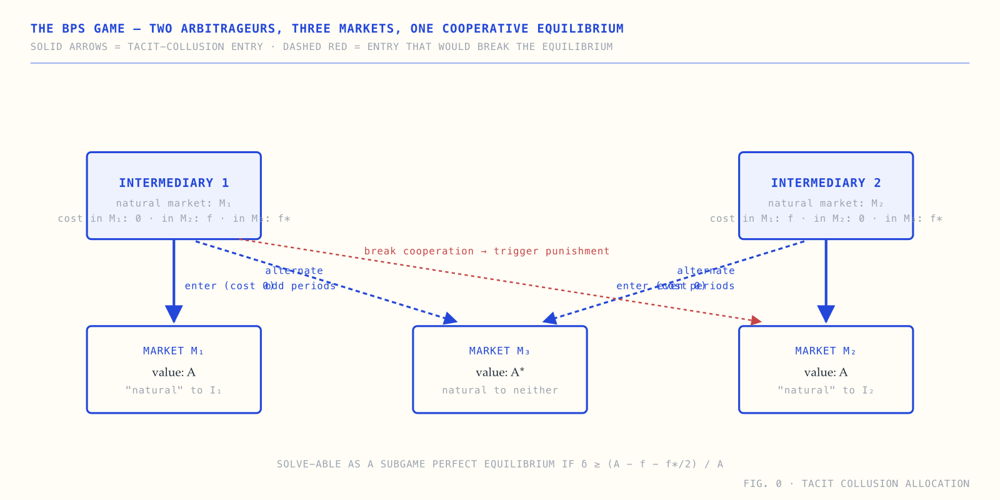

# A Visual Reading of *Strategic Arbitrage in Segmented Markets*

A five-chapter visual reader for Svetlana Bryzgalova, Anna Pavlova, and Taisiya Sikorskaya's December 2024 working paper *Strategic Arbitrage in Segmented Markets*. The paper builds a repeated-game model in which arbitrageurs face fixed entry costs and have "natural" markets, derives a tacit-collusion equilibrium supported by trigger strategies, and tests it on transaction-level U.S. options data from the dividend-play strategy.

This site reorganises and visualises the paper for a first-year PhD reader comfortable with game theory and asset pricing. The mathematical content of the original paper is preserved; the diagrams and narrative re-presentation are this site's only original contribution.

**Live site:** https://bps-2024-visual.vercel.app/ *(after deployment)*

## Visual design

The visual design — cream paper background, deep technical-blue ink, monospace uppercase labels, hand-drawn SVG diagrams, marginalia — is adopted from Dan Hollick's [makingsoftware.com](https://www.makingsoftware.com/). The design system is a direct application of his work to a different subject. The choice of subject and the technical content are the only original contributions in this repository.

## Preview



## Contents

| Page | Description |
|---|---|
| Cover | Three-market schematic showing the tacit-collusion allocation |
| Chapter 1 — The model | Economic environment, payoff function, one-shot Nash, Pareto frontier (Sec 2.1–2.2) |
| Chapter 2 — Tacit collusion | Repeated game, trigger strategies, SPE condition δ ≥ (A − f − f*/2)/A, three testable predictions (Sec 2.3) |
| Chapter 3 — Dividend play | The arbitrage mechanism, OCC random assignment, identification pipeline (Sec 3) |
| Chapter 4 — The data | Three headline facts (57% / 44% / 49%), lack of pecking order, natural-market proxies (Sec 4) |
| Chapter 5 — Regulation | 2014 SEC rule, the near-identical-contract circumvention, proposed fix (Sec 5–6) |
| Terminology | Glossary covering game theory, options machinery, microstructure, and literature |

## Audience

The site is calibrated for a year-1 PhD student at a top finance/accounting programme. The reader is assumed comfortable with:

- Game theory: Nash equilibrium, subgame-perfect equilibrium, repeated games, trigger strategies, the Folk theorem
- Asset pricing: Black-Scholes-Merton, early exercise of American options, ex-dividend mechanics
- Microstructure: market makers, bid-ask spreads, order flow
- Empirical methods: panel regressions, propensity score matching

The site uses the paper's notation directly (π, δ, A, f, k_i^j) and does not avoid mathematical content. What it adds is visualisation and structural reorganisation.

## Local development

```bash
git clone https://github.com/0xadvait/bps-2024-visual.git
cd bps-2024-visual
python3 -m http.server 8000
# open http://localhost:8000/
```

The site has no build step. It consists of hand-written HTML, CSS, and inline SVG, with no JavaScript dependencies. Mobile-responsive.

## Source

Bryzgalova, S., Pavlova, A. &amp; Sikorskaya, T. (2024). *Strategic Arbitrage in Segmented Markets.* Working paper, London Business School and Chicago Booth Business School. December 2024.

JEL: G4, G5, G11, G12.

Author affiliations:
- Svetlana Bryzgalova ([LBS](https://www.london.edu/faculty-and-research/faculty/profiles/b/bryzgalova-svetlana))
- Anna Pavlova ([LBS, CEPR](https://www.london.edu/faculty-and-research/faculty/profiles/p/pavlova-anna))
- Taisiya Sikorskaya ([Chicago Booth](https://www.chicagobooth.edu/faculty/directory/s/taisiya-sikorskaya))

## License

The illustrations, prose, HTML, and CSS in this repository are released under the [MIT License](LICENSE). The underlying scientific content — the model, propositions, empirical results — is the work of Bryzgalova, Pavlova, and Sikorskaya, reproduced here under fair-use principles for educational commentary.

The visual design system is adopted from Dan Hollick's [makingsoftware.com](https://www.makingsoftware.com/).

## Related

- **[Bell 1964 visual reading](https://github.com/0xadvait/bell-1964-visual)** — same design system applied to the EPR paradox paper.
- **[Kothiyal 2021 visual reading](https://github.com/0xadvait/perception-uav-thesis-visual)** — same design system applied to a JHU robotics thesis.

---

Maintained by [@0xadvait](https://github.com/0xadvait) ([X](https://x.com/advait_jayant)).
